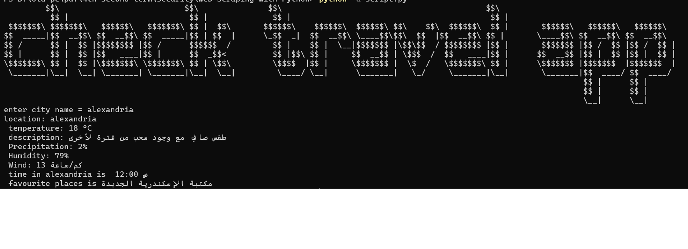

# Web Scraping with Python
---------------------------------------------------------------------------------------------------

# The idea of this project is based on giving information to travelers or those who are familiar with the country from knowing the simple things about each country, including the country’s weather if it is cold and so on.. and also knowing the time difference between them and the desired country, and also Find out the best place to visit

# The site is based on Google search, but the idea is to integrate all of this into just one click

# requirements
 1- pip install requests_html
 2- basic information in html to get the right class and attribute

 # url that used 
 1-https://www.google.com/search?q=weather
 2-https://www.google.com/search?q=time+in
 3-https://www.google.com/search?q=google+travel        

 # how to use it
just run it and type and city you want and it also supports more than one language
or write (now) to know more about your current location

# more detials of tools 
1 user agent is any software, acting on behalf of a user, which "retrieves, renders and facilitates end-user interaction with Web content"
